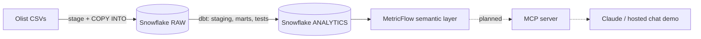

# Conversational analytics on a governed semantic layer

Ask business questions in plain language and get answers computed from
version-controlled metric definitions, not from SQL an LLM improvised.

**Stack:** Snowflake · dbt Core 1.12 · MetricFlow (dbt Semantic Layer) · MCP · Claude · GitHub Actions

> **Status:** data platform and semantic layer are built and validated on


| Phase | Scope | Status |
|---|---|---|
| 1 | Snowflake setup, RBAC, raw data load | Done |
| 2 | dbt staging and marts, 51 tests, CI | Done |
| 3 | Semantic layer: 3 semantic models, 20 metrics | Done |
| 4 | MCP server and web chat app (running locally, deployment next) | Done |
| 5 | Evaluation on golden business questions | Planned |

**[Try the live demo](https://olist-metrics-724060547545.europe-west3.run.app)**


## Why a semantic layer

Letting an LLM write SQL against raw tables works in demos and fails in
practice: it guesses joins, double counts, and defines "revenue" differently
each time. Here the LLM never writes SQL. It picks a metric and dimensions
from a governed catalogue, and MetricFlow compiles the SQL. Every answer
uses the same definition a data team reviewed in a pull request.

## Architecture



## Data

[Olist Brazilian e-commerce](https://www.kaggle.com/datasets/olistbr/brazilian-ecommerce):
9 tables, about 1.55M rows, orders from Sep 2016 to Oct 2018.

## What is built

**Snowflake (phase 1)**
- Three functional roles: `LOADER`, `TRANSFORMER`, and read-only `REPORTER` for the LLM layer
- Key-pair service users, no passwords
- One X-Small warehouse per workload, 60 s auto-suspend, shared resource monitor
- Raw tables stored as `VARCHAR` with load metadata; typing happens in dbt, so bad values never block a load
- Idempotent, scripted setup and load, verified against published row counts

**dbt (phase 2)**
- Staging, intermediate and mart layers (`fct_orders`, `fct_order_items`, 3 dimensions)
- 48 data tests: keys, accepted values, relationships, composite keys, business rules
- Environment-aware schemas (dev, ci, prod)
- GitHub Actions builds and tests every pull request in isolated CI schemas

**Semantic layer (phase 3)**
- New dbt 1.12 YAML spec, semantic definitions next to each model
- Entities, categorical and time dimensions, and a time spine
- Metric types: simple, filtered, ratio, cumulative, and derived with a time offset
- Cross-model joins through a shared `olist_order` entity
- CI also runs `mf validate-configs` against the warehouse

| Metric | Type | Definition |
|---|---|---|
| `orders` | simple | Count of orders |
| `revenue` | simple | Item prices plus freight, all statuses |
| `average_order_value` | ratio | revenue / orders |
| `customers` | simple | Distinct `customer_unique_id` |
| `delivered_orders` | simple, filtered | Orders with status delivered |
| `avg_delivery_days` | simple | Average days from purchase to delivery |
| `avg_review_score` | simple | Average latest review score |
| `late_delivery_rate` | ratio | Late deliveries / deliveries with a known date |
| `cumulative_revenue` | cumulative | Running total of revenue |
| `revenue_growth_mom` | derived | Revenue vs the previous month |
| `items_sold` | simple | Count of order items |
| `product_revenue` | simple | Item prices only, no freight |
| `new_customers` | simple | Customers by date of first valid order (canceled and unavailable excluded) |
| `repeat_customers` | simple, filtered | Customers with more than one valid order |
| `repeat_purchase_rate` | ratio | repeat_customers / new_customers |
| `repeat_customers_90d` | simple, filtered | Customers who ordered again within 90 days |
| `customers_with_90d_window` | simple, filtered | Customers whose 90-day window had ended |
| `repeat_rate_90d` | ratio | repeat_customers_90d / customers_with_90d_window |

## Example results

```bash
mf query --metrics orders,revenue,average_order_value,late_delivery_rate \
  --group-by metric_time__year
```

| Year | Orders | Revenue (BRL) | AOV | Late delivery rate |
|---|---|---|---|---|
| 2016* | 329 | 57K | 173.81 | 1.1% |
| 2017 | 45,101 | 7.14M | 158.37 | 5.6% |
| 2018* | 54,011 | 8.64M | 160.04 | 7.7% |

\*Partial years.

```bash
mf query --metrics product_revenue --group-by order_item__product_category \
  --order -product_revenue --limit 5
```

| Category | Product revenue (BRL) |
|---|---|
| health_beauty | 1.26M |
| watches_gifts | 1.21M |
| bed_bath_table | 1.04M |
| sports_leisure | 988K |
| computers_accessories | 912K |

## Design decisions and findings

- **`review_id` is not unique** in the source (814 duplicates). Reviews use `review_id` + `order_id` as the key, guarded by a test.
- **8 delivered orders have no delivery date.** A warning-level test keeps this visible without blocking builds, and `late_delivery_rate` excludes them from its denominator instead of counting them as on time.
- **`customer_id` is issued per order** in Olist. Customer metrics use `customer_unique_id`; counting `customer_id` would silently equal the order count.
- **`order` is a reserved word in Snowflake**, so the entity is named `olist_order`. This passed locally on DuckDB and failed only against Snowflake, which is why CI validates against the real warehouse.
- **Profit is not answerable:** the dataset has no cost data. The semantic layer only exposes what the data supports.
- **Churn is not well defined here:** about 97% of customers order once. The semantic layer exposes repeat purchase rate instead, plus a 90-day version that excludes customers whose window had not ended, so recent cohorts don't look worse than they are.
- **Canceled-only customers are excluded from customer profiles:** `customers` (all orders) is 96,096 and `new_customers` (valid orders) is 94,990.
- **Repeat customers bring 5.6% of revenue** and have a lower average order value (about 146 vs 161 BRL) than one-time customers.

## Repository layout

```
snowflake/        account setup, raw objects, load, verification SQL
scripts/          key generation, download, upload
dbt/
  models/
    staging/      typed source models
    intermediate/ order-level aggregations
    marts/        facts, dimensions, semantic models and metrics
    utilities/    MetricFlow time spine
  tests/          singular business-rule tests
.github/workflows dbt build + semantic layer validation on every PR
```

## Run it

Requires a Snowflake account, Python 3.12 and a Kaggle API token.

```bash
python -m venv .venv && source .venv/bin/activate
pip install -r requirements.txt
pipx install snowflake-cli

# 1. Snowflake: run snowflake/00_account_setup.sql in Snowsight, then
./scripts/generate_keys.sh        # paste the printed ALTER USER lines into Snowsight
./scripts/download_olist.sh
./scripts/upload_to_stage.sh

# 2. dbt
cp .env.example .env              # fill in account and key path
set -a; source .env; set +a
cd dbt && dbt deps && dbt build

# 3. Semantic layer
mf validate-configs
mf query --metrics revenue --group-by olist_order__customer_state
```

## Roadmap

- Customer-level model for new-customer and repeat-purchase metrics
- MCP server exposing `list_metrics`, `get_dimensions` and `query_metrics`
- Hosted chat demo on Cloud Run, with a DuckDB fallback so it keeps working without a Snowflake account
- Evaluation: semantic layer vs raw text-to-SQL on a fixed set of business questions
