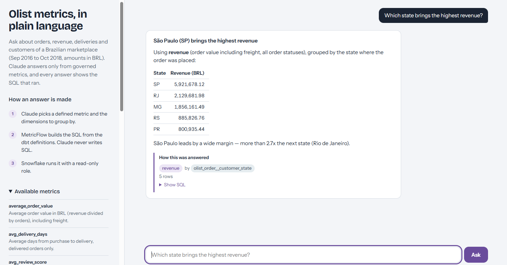
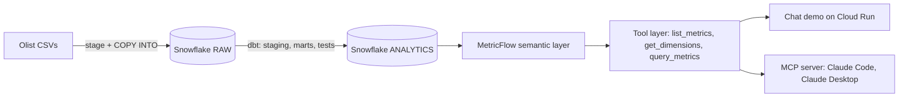

# Conversational analytics on a governed semantic layer

Ask business questions in plain language and get answers computed from
version-controlled metric definitions, not from SQL an LLM improvised.

**Stack:** Snowflake · dbt Core 1.12 · MetricFlow (dbt Semantic Layer) · MCP · Claude · Cloud Run · GitHub Actions

**[Try the live demo](https://olist-metrics-724060547545.europe-west3.run.app)** · the first question after an idle period takes about a minute while the service starts.



| Phase | Scope | Status |
|---|---|---|
| 1 | Snowflake setup, RBAC, raw data load | Done |
| 2 | dbt staging and marts, 51 tests, CI | Done |
| 3 | Semantic layer: 3 semantic models, 20 metrics | Done |
| 4 | MCP server and chat demo on Cloud Run | Done |
| 5 | Evaluation against raw text-to-SQL | Done |
| 6 | DuckDB fallback so the demo outlives the Snowflake trial | Planned |

## Result

**20 business questions, three runs.**

| | Semantic layer | Claude writing SQL on the same tables |
|---|---|---|
| Correct answers | 20/20 in every run | 15 to 17 of 20 |
| Accuracy | 100% | 75 to 85% |
| Average queries per question | 1.9 | 0.9 |

The failures are more interesting than the score. The SQL baseline usually got
the **ranking** right and the **number** wrong:

- Product revenue by category came out 14% too high, and by seller state 17% too
  high, in every run. It added freight, which `product_revenue` excludes by
  definition.
- The 90-day repeat rate was understated every run (1.89% against 2.31%),
  because it divided by all customers instead of only those whose 90-day window
  had ended.
- Revenue by state and by month failed in some runs and passed in others. The
  same question produced different numbers on different days.

Both systems correctly refused the three unanswerable questions (profit, gross
margin, churn), so the gap is about definitions, not about hallucination.

The comparison is between curated metric definitions and a bare schema: the
baseline gets table and column names, which is what most warehouses actually
offer. Gold answers come from hand-written SQL, so neither system is graded
against its own output. Full results, including per-question verdicts for each
run, are in [`eval/`](eval/).

## Why a semantic layer

Letting an LLM write SQL against raw tables demos well and fails quietly: it
guesses joins, double counts, and defines "revenue" differently each time. Here
the LLM never writes SQL. It picks a metric and dimensions from a governed
catalogue, and MetricFlow compiles the SQL from the dbt definitions. Every
answer uses the definition a data team reviewed in a pull request, and the demo
shows that SQL under each answer.

## Architecture



The chat app and the MCP server share one tool layer, so both answer the same
way. Queries run as a read-only Snowflake role that can reach the production
marts and nothing else.

## Data

[Olist Brazilian e-commerce](https://www.kaggle.com/datasets/olistbr/brazilian-ecommerce):
9 tables, about 1.55M rows, orders from Sep 2016 to Oct 2018.

## What is built

**Snowflake**
- Three functional roles: `LOADER`, `TRANSFORMER`, and read-only `REPORTER` for the LLM layer, each with its own X-Small warehouse and a shared resource monitor
- Key-pair service users, no passwords; the demo's key is mounted from Secret Manager
- Raw tables stored as `VARCHAR` with load metadata, so a bad value never blocks a load; typing happens in dbt
- Idempotent, scripted setup and load, verified against published row counts

**dbt**
- Staging, intermediate and mart layers (`fct_orders`, `fct_order_items`, `dim_customer_profiles` and three more dimensions)
- 51 data tests: keys, accepted values, relationships, composite keys, business rules
- Environment-aware schemas (dev, ci, prod, serve)
- GitHub Actions builds and tests every pull request in isolated CI schemas, then validates the semantic layer against the warehouse

**Semantic layer**
- dbt 1.12 YAML spec, semantic definitions next to each model
- Entities, categorical and time dimensions, and a time spine
- Metric types: simple, filtered, ratio, cumulative, and derived with a time offset
- Cross-model joins through shared `olist_order` and `customer` entities

**Serving**
- Three tools: `list_metrics`, `get_dimensions`, `query_metrics`
- FastAPI service on Cloud Run with the chat page, plus the MCP endpoint behind a bearer token
- Guardrails: read-only role, row caps, per-visitor and daily question limits, one instance maximum
- The server re-parses the dbt project for its own target at startup, so it can never read a development schema by mistake

| Metric | Type | Definition |
|---|---|---|
| `orders` | simple | Count of orders, all statuses |
| `revenue` | simple | Item prices plus freight, all statuses |
| `average_order_value` | ratio | revenue / orders |
| `customers` | simple | Distinct customers with any order |
| `delivered_orders` | simple, filtered | Orders with status delivered |
| `avg_delivery_days` | simple | Average days from purchase to delivery |
| `avg_review_score` | simple | Average latest review score, 1 to 5 |
| `late_delivery_rate` | ratio | Late deliveries / deliveries with a known date |
| `cumulative_revenue` | cumulative | Running total of revenue |
| `revenue_growth_mom` | derived | Revenue against the previous month |
| `items_sold` | simple | Count of order items |
| `product_revenue` | simple | Item prices only, no freight |
| `new_customers` | simple | Customers by date of first valid order |
| `repeat_customers` | simple, filtered | Customers with more than one valid order |
| `repeat_purchase_rate` | ratio | repeat_customers / new_customers |
| `repeat_customers_90d` | simple, filtered | Customers who ordered again within 90 days |
| `customers_with_90d_window` | simple, filtered | Customers whose 90-day window had ended |
| `repeat_rate_90d` | ratio | repeat_customers_90d / customers_with_90d_window |

Helper metrics behind the rates (`late_deliveries`, `measured_deliveries`) are
defined as well, but hidden from the demo's catalogue.

## Example results

```bash
mf query --metrics orders,revenue,average_order_value,late_delivery_rate \
  --group-by metric_time__year
```

| Year | Orders | Revenue (BRL) | AOV | Late delivery rate |
|---|---|---|---|---|
| 2016* | 329 | 57K | 173.81 | 1.1% |
| 2017 | 45,101 | 7.14M | 158.37 | 5.6% |
| 2018* | 54,011 | 8.64M | 160.04 | 7.7% |

\*Partial years.

```bash
mf query --metrics product_revenue --group-by order_item__product_category \
  --order -product_revenue --limit 5
```

| Category | Product revenue (BRL) |
|---|---|
| health_beauty | 1.26M |
| watches_gifts | 1.21M |
| bed_bath_table | 1.04M |
| sports_leisure | 988K |
| computers_accessories | 912K |

## Design decisions and findings

- **`review_id` is not unique** in the source (814 duplicates). Reviews use `review_id` + `order_id` as the key, guarded by a test.
- **8 delivered orders have no delivery date.** A warning-level test keeps this visible without blocking builds, and `late_delivery_rate` excludes them from its denominator instead of counting them as on time.
- **`customer_id` is issued per order** in Olist. Customer metrics use `customer_unique_id`; counting `customer_id` would silently equal the order count.
- **`order` is a reserved word in Snowflake**, so the entity is named `olist_order`. This passed locally on DuckDB and failed only against Snowflake, which is why CI validates against the real warehouse.
- **Profit is not answerable:** the dataset has no cost data. The semantic layer only exposes what the data supports, and the assistant says so rather than substituting revenue.
- **Churn is not well defined here:** about 97% of customers order once. The semantic layer exposes repeat purchase rate instead, plus a 90-day version that excludes customers whose window had not ended, so recent cohorts don't look worse than they are.
- **Canceled-only customers are excluded from customer profiles:** `customers` (all orders) is 96,096 and `new_customers` (valid orders) is 94,990.
- **Repeat customers bring 5.6% of revenue** and have a lower average order value (about 146 against 161 BRL) than one-time customers.
- **Late deliveries rose over time:** under 4% through most of 2017, 12.9% in 2018 Q1, then back to 4 to 5%.
- **Region means two things.** Order state and customer home state give different revenue totals, so the assistant is told which to use for which kind of question. The first version answered the same question both ways on different days.

## Repository layout

```
snowflake/        account setup, raw objects, load, verification, grants
scripts/          key generation, data download, stage upload, deployment
dbt/
  models/
    staging/      typed source models
    intermediate/ order-level aggregations
    marts/        facts, dimensions, semantic models and metrics
    utilities/    MetricFlow time spine
  tests/          singular business-rule tests
app/              tool layer, MCP server, FastAPI demo
eval/             questions with gold SQL, runner, results
.github/workflows dbt build and semantic layer validation on every PR
```

## Run it

Requires a Snowflake account, Python 3.12, a Kaggle API token and an Anthropic
API key.

```bash
python -m venv .venv && source .venv/bin/activate
pip install -r requirements.txt
pipx install snowflake-cli

# 1. Snowflake: run snowflake/00_account_setup.sql in Snowsight, then
./scripts/generate_keys.sh        # paste the printed ALTER USER lines into Snowsight
./scripts/download_olist.sh
./scripts/upload_to_stage.sh

# 2. dbt
cp .env.example .env              # account, key paths, Anthropic key
set -a; source .env; set +a
cd dbt && dbt deps && dbt build --target prod

# 3. Ask questions on the command line
mf validate-configs
mf query --metrics revenue --group-by olist_order__customer_state

# 4. Or run the chat demo and the MCP endpoint locally
DBT_TARGET=serve uvicorn app.web:app --reload

# 5. Reproduce the evaluation
DBT_TARGET=serve python -m eval.run_eval
```

For MCP clients, `.mcp.json` starts the server over stdio; Claude Code picks it
up from the repo root.

## Roadmap

- DuckDB fallback bundled with the app, so the demo keeps running once the Snowflake trial ends
- More metrics: delivery performance by seller, cohort retention
